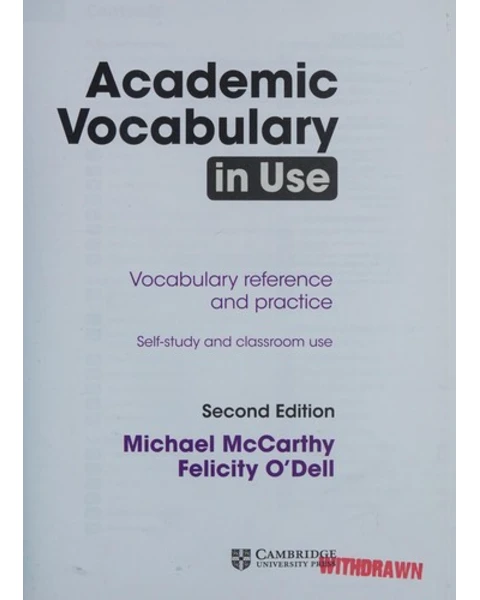
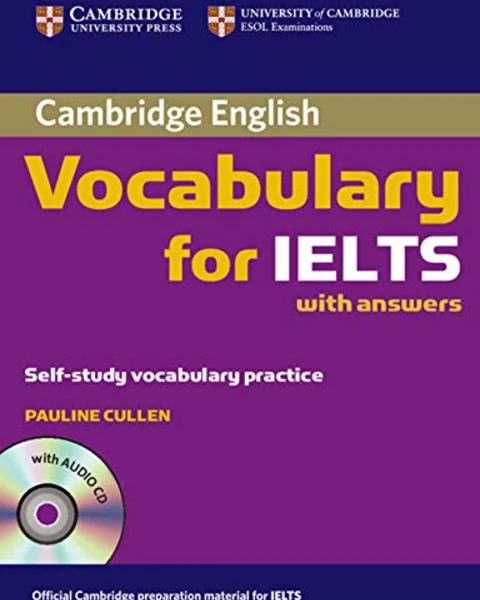
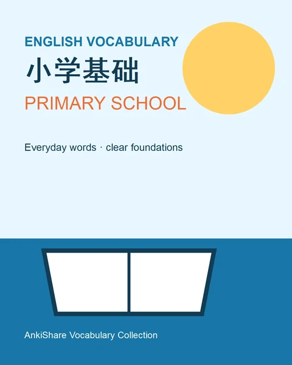
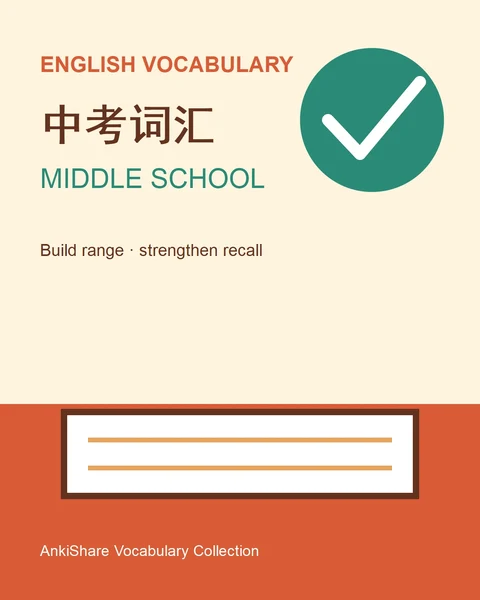
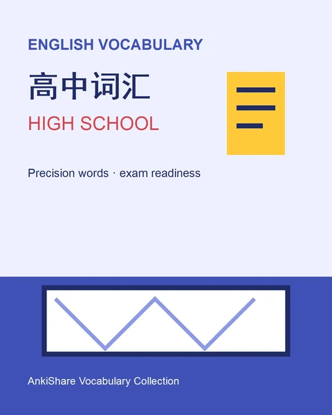
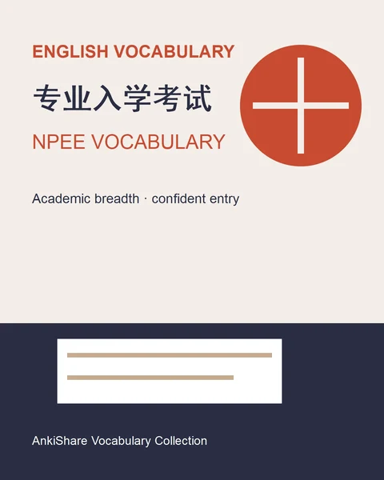

  

<h1 align="center">Anki 卡组资料库</h1>

  在 English Anchor 发布可下载、可持续更新的英语学习 Anki 卡组。

  <a href="https://englishanchor.online">English Anchor 官网</a>
  ·
  <a href="https://t.me/+zUqHQVAF42xlODgx">Telegram 交流群</a>

## 卡组下载

卡组通过 GitHub Releases 发布。下表记录每个卡组当前 Release 中可下载的最新版本；卡组更新后，会同步更新日期、版本和下载链接。

| 卡组 | 介绍 | 更新日期 | 版本 | 下载链接 | 条目清单 |
| --- | --- | --- | --- | --- |
|  NCE2 實踐與進步（Practice & Progress） | 第二册课文逐句学习，配有中文理解、句型和完整笔记 | 2026-08-14 | `nce2-v1.0.2` | [下载 APKG](https://github.com/andylee1890/AnkiShare/releases/download/nce2-v1.0.2/NCE2-Practice-and-Progress.apkg) | [条目清单](https://github.com/andylee1890/AnkiShare/releases/download/nce2-v1.0.2/NCE2-Practice-and-Progress.json) |
|  NCE3 培養技能（Developing Skills） | 第三册课文逐句学习与背诵，配有语法、词汇、表达和知识点笔记 | 2026-08-16 | `nce3-v1.0.1` | [下载 APKG](https://github.com/andylee1890/AnkiShare/releases/download/nce3-v1.0.1/NCE3-Developing-Skills.apkg) | [条目清单](https://github.com/andylee1890/AnkiShare/releases/download/nce3-v1.0.1/NCE3-Developing-Skills.json) |
|  NCE4 流利英語（Fluency in English） | 第四册课文逐句学习与背诵，配有语法、词汇、表达和知识点笔记 | 2026-08-16 | `nce4-v1.0.1` | [下载 APKG](https://github.com/andylee1890/AnkiShare/releases/download/nce4-v1.0.1/NCE4-Fluency-in-English.apkg) | [条目清单](https://github.com/andylee1890/AnkiShare/releases/download/nce4-v1.0.1/NCE4-Fluency-in-English.json) |
|  新概念短语 | 新概念英语学习中的高频短语与固定搭配，含释义、例句和词典资料 | 2026-08-14 | `nce-phrases-v1.0.0` | [下载 APKG](https://github.com/andylee1890/AnkiShare/releases/download/nce-phrases-v1.0.0/New-Concept-English-Phrases.apkg) | [条目清单](https://github.com/andylee1890/AnkiShare/releases/download/nce-phrases-v1.0.0/New-Concept-English-Phrases.json) |
|  新概念英语第一册词汇 | 新概念英语第一册核心词汇，按单词提供认读、拼写和听写练习。 | 2026-08-15 | `nce1-vocabulary-v1.0.0` | [下载 APKG](https://github.com/andylee1890/AnkiShare/releases/download/nce1-vocabulary-v1.0.0/New-Concept-English-1-Vocabulary.apkg) | [条目清单](https://github.com/andylee1890/AnkiShare/releases/download/nce1-vocabulary-v1.0.0/New-Concept-English-1-Vocabulary.json) |
|  新概念英语第二册词汇 | 新概念英语第二册核心词汇，按单词提供认读、拼写和听写练习。 | 2026-08-15 | `nce2-vocabulary-v1.0.0` | [下载 APKG](https://github.com/andylee1890/AnkiShare/releases/download/nce2-vocabulary-v1.0.0/New-Concept-English-2-Vocabulary.apkg) | [条目清单](https://github.com/andylee1890/AnkiShare/releases/download/nce2-vocabulary-v1.0.0/New-Concept-English-2-Vocabulary.json) |
|  新概念英语第三册词汇 | 新概念英语第三册核心词汇，按单词提供认读、拼写和听写练习。 | 2026-08-15 | `nce3-vocabulary-v1.0.0` | [下载 APKG](https://github.com/andylee1890/AnkiShare/releases/download/nce3-vocabulary-v1.0.0/New-Concept-English-3-Vocabulary.apkg) | [条目清单](https://github.com/andylee1890/AnkiShare/releases/download/nce3-vocabulary-v1.0.0/New-Concept-English-3-Vocabulary.json) |
|  新概念英语第四册词汇 | 新概念英语第四册核心词汇，按单词提供认读、拼写和听写练习。 | 2026-08-15 | `nce4-vocabulary-v1.0.0` | [下载 APKG](https://github.com/andylee1890/AnkiShare/releases/download/nce4-vocabulary-v1.0.0/New-Concept-English-4-Vocabulary.apkg) | [条目清单](https://github.com/andylee1890/AnkiShare/releases/download/nce4-vocabulary-v1.0.0/New-Concept-English-4-Vocabulary.json) |
|  朗文3000 | 朗文 3000 核心高频词汇，适合构建通用英语词汇基础。 | 2026-08-15 | `longman-3000-v1.0.0` | [下载 APKG](https://github.com/andylee1890/AnkiShare/releases/download/longman-3000-v1.0.0/Longman-3000.apkg) | [条目清单](https://github.com/andylee1890/AnkiShare/releases/download/longman-3000-v1.0.0/Longman-3000.json) |
|  朗文学术词汇 | 面向学术阅读与写作的朗文词汇集合。 | 2026-08-15 | `longman-academic-vocabulary-v1.0.0` | [下载 APKG](https://github.com/andylee1890/AnkiShare/releases/download/longman-academic-vocabulary-v1.0.0/Longman-Academic-Vocabulary.apkg) | [条目清单](https://github.com/andylee1890/AnkiShare/releases/download/longman-academic-vocabulary-v1.0.0/Longman-Academic-Vocabulary.json) |
|  大学英语四级词汇 | 大学英语四级考试词汇，提供认读、拼写和听写三种练习。 | 2026-08-15 | `cet4-vocabulary-v1.0.0` | [下载 APKG](https://github.com/andylee1890/AnkiShare/releases/download/cet4-vocabulary-v1.0.0/College-English-Test-Band-4-Vocabulary.apkg) | [条目清单](https://github.com/andylee1890/AnkiShare/releases/download/cet4-vocabulary-v1.0.0/College-English-Test-Band-4-Vocabulary.json) |
|  大学英语六级词汇 | 大学英语六级考试词汇，提供认读、拼写和听写三种练习。 | 2026-08-15 | `cet6-vocabulary-v1.0.0` | [下载 APKG](https://github.com/andylee1890/AnkiShare/releases/download/cet6-vocabulary-v1.0.0/College-English-Test-Band-6-Vocabulary.apkg) | [条目清单](https://github.com/andylee1890/AnkiShare/releases/download/cet6-vocabulary-v1.0.0/College-English-Test-Band-6-Vocabulary.json) |
|  考研英语词汇 | 考研英语词汇，提供认读、拼写和听写三种练习。 | 2026-08-15 | `postgraduate-vocabulary-v1.0.0` | [下载 APKG](https://github.com/andylee1890/AnkiShare/releases/download/postgraduate-vocabulary-v1.0.0/Postgraduate-Entrance-Examination-Vocabulary.apkg) | [条目清单](https://github.com/andylee1890/AnkiShare/releases/download/postgraduate-vocabulary-v1.0.0/Postgraduate-Entrance-Examination-Vocabulary.json) |
|  雅思词汇 | 雅思词汇，提供认读、拼写和听写三种练习。 | 2026-08-15 | `ielts-vocabulary-v1.0.0` | [下载 APKG](https://github.com/andylee1890/AnkiShare/releases/download/ielts-vocabulary-v1.0.0/IELTS-Vocabulary.apkg) | [条目清单](https://github.com/andylee1890/AnkiShare/releases/download/ielts-vocabulary-v1.0.0/IELTS-Vocabulary.json) |
|  托福词汇 | 托福词汇，提供认读、拼写和听写三种练习。 | 2026-08-15 | `toefl-vocabulary-v1.0.0` | [下载 APKG](https://github.com/andylee1890/AnkiShare/releases/download/toefl-vocabulary-v1.0.0/TOEFL-Vocabulary.apkg) | [条目清单](https://github.com/andylee1890/AnkiShare/releases/download/toefl-vocabulary-v1.0.0/TOEFL-Vocabulary.json) |
|  GRE词汇 | GRE 词汇，提供认读、拼写和听写三种练习。 | 2026-08-15 | `gre-vocabulary-v1.0.0` | [下载 APKG](https://github.com/andylee1890/AnkiShare/releases/download/gre-vocabulary-v1.0.0/GRE-Vocabulary.apkg) | [条目清单](https://github.com/andylee1890/AnkiShare/releases/download/gre-vocabulary-v1.0.0/GRE-Vocabulary.json) |
|  小学英语基础词汇 | 小学英语基础词汇，提供认读、拼写和听写三种练习。 | 2026-08-21 | `primary-school-vocabulary-v1.0.0` | [下载 APKG](https://github.com/andylee1890/AnkiShare/releases/download/primary-school-vocabulary-v1.0.0/Primary-School-English-Vocabulary.apkg) | [条目清单](https://github.com/andylee1890/AnkiShare/releases/download/primary-school-vocabulary-v1.0.0/Primary-School-English-Vocabulary.json) |
|  中考英语词汇 | 中考英语核心词汇，提供认读、拼写和听写三种练习。 | 2026-08-21 | `middle-school-vocabulary-v1.0.0` | [下载 APKG](https://github.com/andylee1890/AnkiShare/releases/download/middle-school-vocabulary-v1.0.0/Middle-School-English-Vocabulary.apkg) | [条目清单](https://github.com/andylee1890/AnkiShare/releases/download/middle-school-vocabulary-v1.0.0/Middle-School-English-Vocabulary.json) |
|  高中英语词汇 | 高中英语核心词汇，提供认读、拼写和听写三种练习。 | 2026-08-21 | `high-school-vocabulary-v1.0.0` | [下载 APKG](https://github.com/andylee1890/AnkiShare/releases/download/high-school-vocabulary-v1.0.0/High-School-English-Vocabulary.apkg) | [条目清单](https://github.com/andylee1890/AnkiShare/releases/download/high-school-vocabulary-v1.0.0/High-School-English-Vocabulary.json) |
|  英语专业入学考试词汇 | 英语专业入学考试词汇，提供认读、拼写和听写三种练习。 | 2026-08-21 | `npee-vocabulary-v1.0.0` | [下载 APKG](https://github.com/andylee1890/AnkiShare/releases/download/npee-vocabulary-v1.0.0/NPEE-English-Vocabulary.apkg) | [条目清单](https://github.com/andylee1890/AnkiShare/releases/download/npee-vocabulary-v1.0.0/NPEE-English-Vocabulary.json) |

### Anki 样式资源包

这不是卡组，不能通过 Anki 的“导入文件”功能导入。它是卡片模板依赖的 CSS、JavaScript 和配置文件集合，用于修复词典等外部样式在本地 Anki 中失效的问题：

[下载 note-resources-v1.0.0](https://github.com/andylee1890/AnkiShare/releases/download/note-resources-v1.0.0/AnkiShare-note-resources-v1.0.0.zip)

使用方法（Anki Desktop）：

1. 退出 Anki，确保 Anki 已完全关闭。
2. 打开上面的 Release 链接，下载 `AnkiShare-note-resources-v1.0.0.zip`。
3. 找到 Anki 的用户数据目录。Windows 默认位置是 `%APPDATA%\\Anki2`，例如 `C:\\Users\\Administrator\\AppData\\Roaming\\Anki2`。
4. 进入正在使用的账户目录，例如 `账户 1`，再进入其中的 `collection.media` 目录：`C:\\Users\\Administrator\\AppData\\Roaming\\Anki2\\账户 1\\collection.media`。
5. 先备份 `collection.media`，然后把 ZIP 内的全部文件（以 `_` 开头的 CSS、JS、JSON、INI 文件）直接解压到这个 `collection.media` 目录的根部。解压后应当能看到类似 `账户 1\\collection.media\\_oxford.css` 的路径，不要多套一层 `note-resources` 文件夹。
6. 重新启动 Anki，打开卡片预览或学习页面检查样式。如果你使用了多个 Anki 配置文件或账户，请把资源复制到实际使用的每个账户的 `collection.media` 中。

资源包只补充媒体目录中的模板依赖，不会修改卡片内容、牌组、复习记录或 Anki 数据库；覆盖同名文件前请保留自己的备份。

> 下载后请使用 Anki Desktop、AnkiMobile、AnkiDroid 或其他兼容 Anki `.apkg` 格式的应用导入。

## 这个项目是什么

AnkiShare 是 English Anchor 的卡组制作与发布配套项目。这里维护卡片模板和发布说明；实际的 `.apkg` 文件不提交到 Git，而是作为 GitHub Release 附件发布。

Anki 仍然是本地卡片制作和最终导出的工作台。项目不依赖 AnkiWeb 存储，卡组文件由项目维护者自行发布和更新。

三个牌组均以课文句子为学习单位。第二册属于入门阶段，已补全四个单元的笔记；第三册和第四册提供更密集的语法、词汇、表达和知识点整理。部分句子没有额外笔记并不表示卡片缺失，而是根据句子本身的学习价值保留简洁内容。

第三册的历史 AnkiWeb 页面为[新概念第三册课文【按句子背诵、带笔记】](https://ankiweb.net/shared/info/1533041577)，第四册的历史页面为[新概念第四册课文【按句子背诵、带笔记】](https://ankiweb.net/shared/info/1169581791)。历史页面中的文件和说明可能早于本项目当前版本；GitHub Releases 中的 APKG 才是当前发布文件。

## 项目内容

- `docs/`：卡组发布、维护和使用相关文档。
- `note-templates/`：从 Anki 导出的笔记类型、字段、卡片正反面模板与 CSS，可审阅、可版本控制。
- `note-resources/`：卡片模板依赖的 CSS、JavaScript 等媒体资源标准源；维护后同步到本地 Anki 的 `collection.media`。
- `release-records/index.json`：面向 English Anchor 网站的卡组与 Release 主索引，包含当前版本、历史版本、下载地址、文件大小和 SHA-256。

样式资源包的 Release 与卡组 Release 分开维护。`note-resources-v*` 只包含可复制到 Anki `collection.media` 的模板依赖文件，不是 `.apkg` 卡组；网站读取索引时应根据 `type` 字段区分 `deck` 与 `note-resources`。

## 版本与发布

每个卡组使用独立的 GitHub Release 版本。发布前应完成：

1. 在 Anki 中复核卡片内容和媒体。
2. 导出 `.apkg`，在干净的 Anki 环境中测试导入。
3. 计算文件校验和，并将文件附加到 Release。
4. 回填本 README 的卡组表格，确保链接指向当前 Release 附件。

仓库不提交 `.apkg`、Anki 数据库、媒体目录、复习记录或其他个人集合数据。

## 为什么不再依赖 AnkiWeb

> **AnkiWeb 单个账户的可用空间上限为 300 MB。** 当一个带有大量音频、图片等媒体文件的卡组本身就接近或超过 300 MB 时，即使删除其他卡组，也无法稳定地通过同一个 AnkiWeb 账户继续上传、同步或更新它。

Anki 官方手册将 AnkiWeb 定义为用于跨设备同步卡片和媒体的服务，详见[官方同步说明](https://docs.ankiweb.net/syncing.html)。本项目因此保留 Anki 作为本地制作和导出工具，但不把 AnkiWeb 作为卡组发布渠道；`.apkg` 文件会由本项目维护者通过 GitHub Releases 或 English Anchor 官网发布。300 MB 是当前服务限制，未来如 Anki 官方调整配额，应以官方账户页面和最新文档为准。
